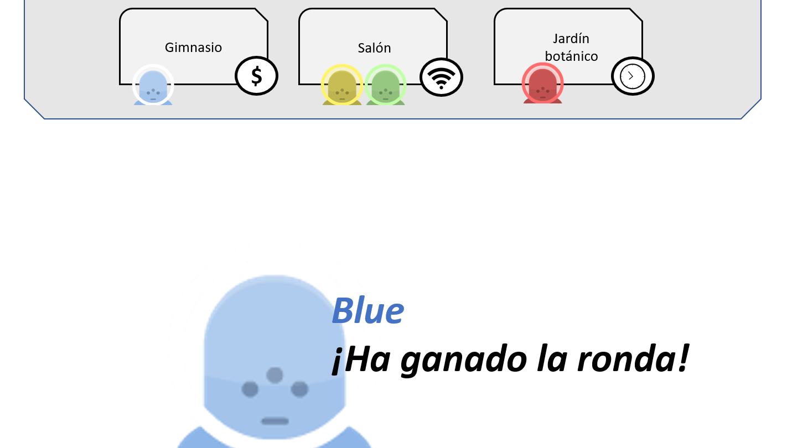
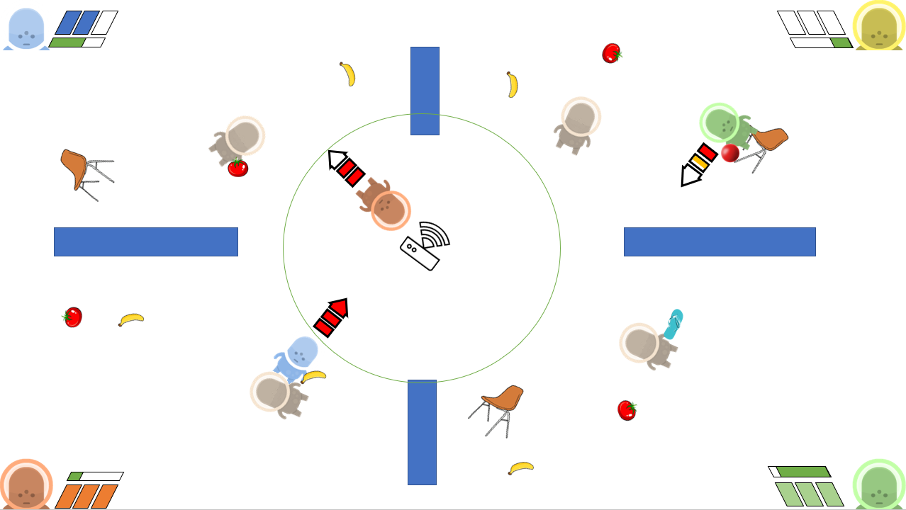
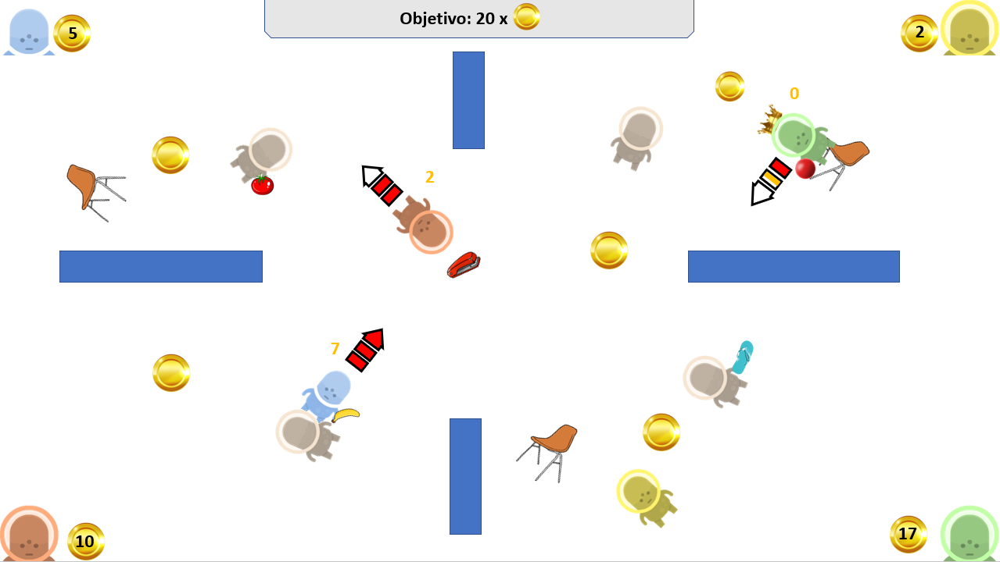
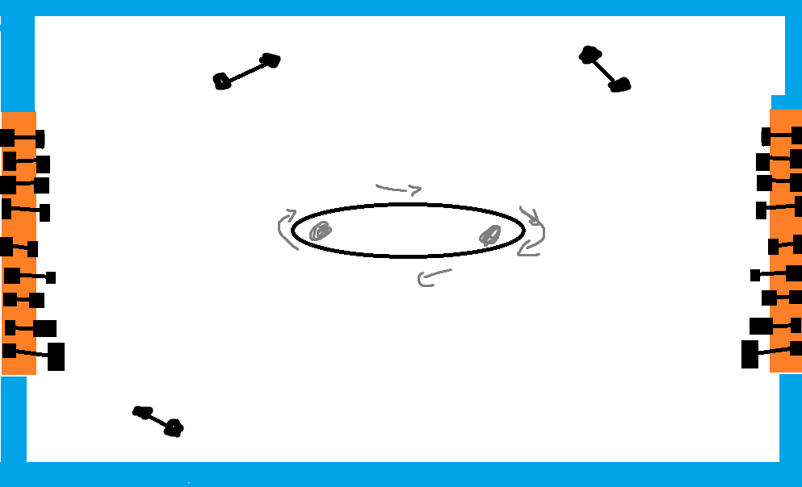
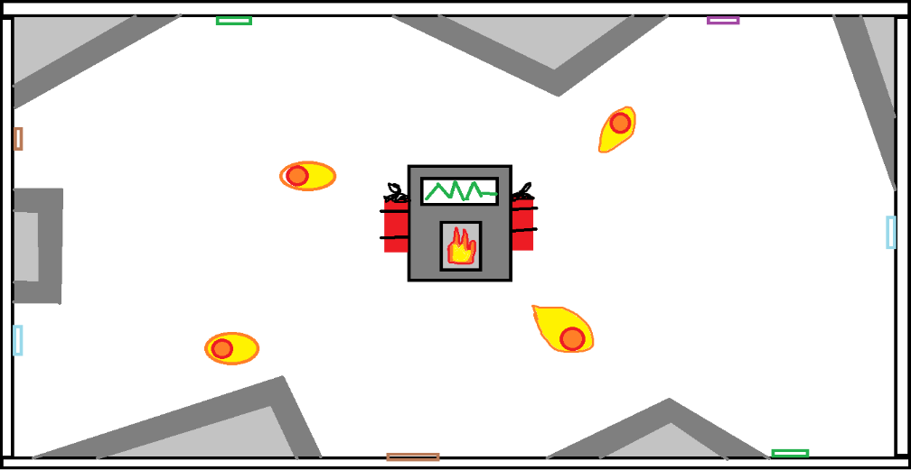
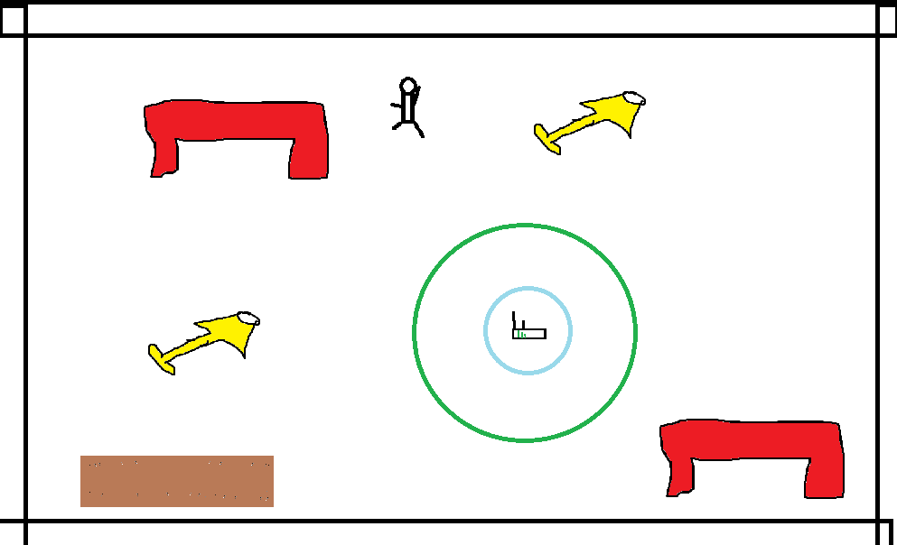

# Documento de diseño

---
## 1. Introducción:
Programa de Convivencia Espacial es un party-game en el que los jugadores controlarán astronautas para pelearse por el control de diversas estaciones espaciales
hasta el espacio profundo.
El juego se desarrollará en rápidas rondas, valiéndose de sus habilidades para disparar armas y lanzar objetos del mobiliario además de moverse en entornos
sin gravedad, impulsándose desde paredes, objetos y los cuerpos de sus enemigos.

---
## 2. Historia:
De entre todos los experimentos a los que te podías haber apuntado para sacarte unos euros de más, has acabado en el peor de todos. 
Bienvenido al PCE (Programa de Convivencia Espacial), en el que, durante varios y tortuosos meses, convivirás con gente de todo el mundo, con todos los
choques (culturales y físicos) que eso conlleva. ¿Lograrás volver a la tierra siendo el mejor (y más rico) compañero de piso espacial?

---
## 3. Personajes:
Los jugadores encarnan a un astronauta participante en el PCE. Cada astronauta pertenece a una nación diferente. 
Esto se verá reflejado en su aspecto físico, ya que su traje llevará bordada la bandera de su nación correspondiente.

---
## 4. Gameplay:

### 4.1 Controles:

*El juego está pensado para jugarlo con mando pero implementaremos controles de teclado durante el desarrollo*

### 4.2 Formatos de partida: 
*Programa de Convivencia Espacial tiene 3 formatos de partida que buscan ofrecer una experiencia de juego personalizada.*
- **Clásico:** Es el modo de juego principal. En él, los jugadores escogen una estación espacial compuesta por varios módulos/niveles. Tanto el orden de los módulos como el formato de juego de cada módulo será fijo.

&#x200C; 

- **Libre:** Los jugadores pueden escoger el módulo de la estación que prefieran, además del módulo que prefieran.

&#x200C;

- **Aleatorio:** Los jugadores eligen el número de rondas a las que quieren jugar. A continuación, saldrán 3 módulos con un formato distinto. Los jugadores tendrán que votar para decidir el nivel al que jugarán.

*En este ejemplo de cómo funcionaría el modo aleatorio, vemos a los 4 jugadores votando por el siguiente mapa al terminar la ronda.*

### 4.3 Modos de juego:

*Cada módulo se podrá jugar de varias maneras distintas. Estos cambian el objetivo de la partida y la dinámica de juego.*

*En cada apartado se muestra una captura de lo que sería un momento cualquiera en cada modo.*

#### Por tiempo:
Al matar a un enemigo, los jugadores obtendrán un punto. Al terminar este tiempo, quien tenga más puntos ganará la ronda.

#### Por vidas:
Cada jugador tendrá una cantidad limitada de vidas. El último que quede con vida gana la ronda.

#### ¡Pelea por el mando!:

En un punto del módulo habrá un mando por el que los jugadores se pelearán por recoger.
Al recogerlo, el jugador empezará a sumar puntos hasta llegar al tiempo objetivo.
Cuando un jugador llegue al tiempo objetivo, acabará la ronda en el módulo.

#### Wi-Fight:

En el módulo habrá un router wi-fi que se moverá por el escenario rebotando por las paredes.
El objetivo de los jugadores será descargar sus archivos, para lo que tendrán que acercarse al router. Cuantos más jugadores haya en el área del router, más lentamente descargarán los datos.

Cuando un jugador consiga descargar todos sus archivos, acabará la ronda en el módulo.

#### Capitalismo:

En el escenario aparecen monedas que los jugadores deberán recoger. Al golpear a los enemigos, soltarán monedas. En este modo de juego los jugadores son invulnerables y cuando son golpeados pierden dinero y son empujados. Al acabarse el tiempo, el jugador con más dinero gana.

### 4.4 Mecánicas:

*En este apartado se exploran las acciones que el jugador puede ejercer*

#### 4.4.1 Vida:
Los jugadores dispondrán de 3 puntos de vida. Irán perdiendo estos puntos conforme vayan siendo impactados por fuego enemigo. Cuando pierdan todos los puntos de vida, quedarán inconscientes y al cabo de un breve tiempo de respawn, otro personaje de su facción saldrá de su base.

#### 4.4.2 Desplazamiento por el escenario:

#### Impulsos:
Al mantener un botón, el jugador cargará una flecha de impulso. Su dirección se podrá controlar con el joystick. La flecha está dividida en 3 segmentos de potencia. Si el jugador está volando por el aire, solo podrá cargarla hasta el segundo segmento. Si se agarra a una plataforma, podrá cargar hasta el tercer segmento.

A medida que el jugador cargue el impulso, se llenarán los segmentos de la flecha. Para calcular la fuerza del impulso, se contarán los segmentos que el jugador haya cargado. De este modo, si el jugador ha cargado un segmento y medio, el impulso resultante será de un segmento de potencia.

*Ejemplo de un jugador cargando su salto*

Si el jugador libera el impulso en una plataforma, saldrá disparado en la dirección de la flecha. La potencia del impulso desde una plataforma incrementa exponencialmente con el número de segmentos cargados.

Si el jugador libera el impulso en el aire, soltará una flatulencia para conseguir redirigirse hacia una dirección. Sin embargo, si el jugador está en el aire pero libera el salto junto a un objeto suficientemente grande como un cadáver, se impulsará desde el mismo, con la potencia de un salto desde una plataforma.

*Gráfica que muestra la potencia de los saltos en diversas situaciones*

#### Agarrarse a superficies:

El jugador puede agarrarse a una pared o a un objeto pesado volando por el nivel para detenerse y poder terminar de cargar su impulso.
Al agarrarse, sus fuerzas se suman y se modificará la trayectoria de ambos.

#### Basura espacial:

Objetos que se mueven con velocidad uniforme por el mapa. Si son suficientemente grandes, los jugadores se podrán agarrar a ellos.
Cuando impactan con un jugador, si este no se agarra, se comportan como en una colisión normal.
Si el objeto va a mucha velocidad y el jugador no se agarra, muere instantáneamente debido al impacto.

#### Cadáveres:

Cuando un jugador es derrotado, su avatar se queda inconsciente volando a la deriva con el arma que llevaba. Pasado un breve tiempo de respawn, saldrá otro avatar de su facción desde su base.
Los cadáveres flotan por el escenario rebotando con las paredes. Estos actuarán como un objeto sólido, permitiendo impulsarse desde los mismos. Además, al pasar al lado de un cadáver, el jugador podrá recoger su arma.
Por último, si un jugador se impulsa desde un cadáver hacia una dirección, el cadáver saldrá impulsado hacia la dirección contraria, convirtiéndose en un proyectil para el enemigo. Si un cadáver con alta velocidad impacta con un jugador, le dejará inconsciente por unos segundos y le desarmará. Si el impacto se produce al lado de una pared, el jugador será aplastado y morirá. Si el cadáver lleva una velocidad muy alta, el jugador morirá directamente.

#### 4.4.3 Armas y combate:

*Los jugadores podrán recoger armas que aparecen por el escenario para usarlas para ganar las rondas. Al pasar de una ronda a otra los jugadores no conservarán las armas obtenidas.*

- **Disparar:** El jugador utilizará sus armas para derrotar a los otros jugadores. Si el arma tiene retroceso, modificará la trayectoria del jugador.

&#x200C; 

- **Lanzar armas:** El jugador puede lanzar un arma para desarmar a los enemigos con el impacto, hacer daño (según el arma) y así poder coger armas nuevas. Al cabo de un tiempo, si el arma no tiene munición restante, desaparecerá para limpiar el escenario.

&#x200C; 

- **Recoger armas:** El jugador puede recoger un arma de un cadaver o del entorno con la pulsación de un botón. Si el jugador ya lleva un arma, la intercambiará por el arma que recoge y la antigua se quedará flotando por el escenario.

&#x200C; 

- **Aparición de armas por el escenario:** Las armas aparecerán en puntos fijos del escenario. Estas armas estarán sujetas a las físicas, de modo que un jugador podrá lanzar un objeto a las mismas para moverlas de posición si él lo desea. 
Cuando un jugador recoge un arma, empezará el tiempo de respawn del lugar donde la recogió. 

&#x200C;

- **Tipos de armas:** *Actualmente las armas se dividen en 3 subclases*

**● Armas cuerpo a cuerpo:**

**- Confeti:** Arma de corto alcance que ejerce 2 puntos de daño y aplica un gran impulso al otro jugador (onda expansiva).

**- La chancla:** Arma cuerpo a cuerpo de corto alcance que hace una cantidad de daño inversamente proporcional a la vida del jugador que la usa (1 punto de daño si se tienen 3 de vida, 2 si se tienen 2 puntos de vida y 3 si solo queda 1 punto de vida).

**- Toalla mojada** Arma cuerpo a cuerpo de medio alcance que hace 1 punto de daño al anemigo y además le empuja una grán distancia. La tolla solo hace su efecto en una pequeña área al extremo final de su rango.

**● Armas a distancia:**

**- Objetos contundentes:** Son armas arrojadizas de un solo uso repartidos por el escenario que hacen 1 punto de daño. Estos pueden venir en varias formas (rocas, ladrillos, libros, tuppers congelados...) pero su tamaño será similar.

**- Mancuernas:** Arma de un solo uso que al impactar contra el enemigo ejerce 2 puntos de daño. Su velocidad es menor que la de los objetos contundentes.

**-Plátanos pistola:** Arma de un solo uso que dispara una bala (plátano) que es mortal al impacto (3 puntos de daño). El proyectil avanza muy léntamente.

**-Rayo láser:** Al pulsar el botón de disparo genera un rayo láser que si contacta con un enemigo durante 2 segundos seguidos, le ejercerá 2 puntos de daño.

**-Grapadora:** Arma a distancia con poca munición que ejerce 1 punto de daño por disparo.

**● Armas misceláneas:**

**-Extintor:** Permite que el jugador se mueva libremente por el escenario gracias a la espuma a presión. No ejerce daño, pero al lanzarlo puede desarmar.

**-Tomate granada:** Funcionan como una granada normal y al estallar crea un pequeño radio que además de aplicar 2 puntos de daño hace un impulso (onda expansiva).

### 4.5 Interfaz de usuario:

*La UI durante las partidas se mantendrá al mínimo para que se entrometa lo mínimo en la experiencia de juego.*

*Dado que la condición de victoria varía por cada modo de juego. La UI cambiará apropiadamente.*

- **Por tiempo:**

En este modo de juego nos interesa mostrar la vida del jugador, el tiempo restante y el número de bajas que lleva cada jugador.

- **Por vidas:**

En este modo de juego nos interesa el número de vidas restantes que tiene cada jugador.

- **¡Pelea por el mando!:**

En este modo de juego nos interesa saber el progreso de victoria que lleva cada personaje.

- **Wi-Fight:**

Al igual que en el modo de juego anterior, en este modo de juego nos interesa saber el progreso de victoria que lleva cada personaje.

- **Capitalismo:**

En este modo de juego nos interesa saber el número de monedas que ha ganado cada jugador y el número necesario de monedas para ganar. 
Como en este modo los jugadores no pueden morir, no será necesario representar el número de vidas.

### 4.6 Escenarios:

*En este apartado enumeramos todos los módulos diseñados con los elementos y peligros que contienen, además de un pequeño dibujo conceptual.*

- **Gimnasio:**

	- **Bancos de mancuernas:** Estarán repartidas por el escenario y el jugador podrá recoger mancuernas de ellas para lanzar a sus enemigos.
	
	- **Cintas de correr:** El jugador se puede agarrar a ellas. Al soltarse, saldrá disparado en una dirección. A lo largo de la partida, ganarán velocidad.
	
	- **Paredes acolchadas:** Permiten el rebote del jugador.
	

- **Sala de máquinas:**

	- **Horno:** En el centro de la arena hay un horno que expulsa bolas de fuego periódicamente.
	
	- **Bolas de fuego:** Al tocarlas, el jugador arderá y morirá (hacen 3 puntos de daño). Cuando toquen una pared, desaparecerán.
	
	- **Tuberías:** Plataformas estáticas repartidas por el escenario a las que el jugador se puede agarrar.
	
	- **Botones:** Se pueden activar con un disparo o con un golpe. Permiten la aceleración o la deceleración del horno.
	

- **Jardin botánico:**

	- **Plantas sospechosas:** Expulsan polen periódicamente que al tocarlo invierte los controles.
	
	- **Plataneros:** Generan plátanos pistola.
	
	- **Tomateras:** Generan tomates granada.
	
	- **Plantas carnívoras:** Devoran a los jugadores que se acerquen a ellas.

- **Cocina:**

	- **Nevera:** Expulsa alimentos periódicamente. Los alimentos se pueden lanzar a los enemigos.
	
	- **Mesa magnética:** Se activa al presionar un botón. Al estar activa, atrae todos los objetos metálicos a alta velocidad hacia ella, haciendo daño a los jugadores a su paso.
	
	- **Utensilios de cocina:** Funcionan como armas arrojadizas.
	

	
- **Sala de estar:**

*No hay peligros mortales para el jugador, pero hay una multitud de objetos que los jugadores se pueden arrojar (sillas, lámparas…)*

- **Entrada de la estación:**

	- **Compuertas:** Hay 4 repartidas por el escenario. Estas se irán abriendo de forma regular cada cierto tiempo. Antes de abrirse, un muro dividirá la sala en secciones. De este modo, si el jugador escapa de la sección que va a ser abierta al espacio, sobrevivirá. Si un jugador sale lanzado al espacio, morirá.
	

*Disponibilidad de modos de juego en cada mapa (0 no está disponible, 1 si lo está):*

|   | cocina | gimnasio | s. de máquinas | s. de estar | entrada estación |
| --- | --- | --- | --- | --- | --- |
| Por vidas | 1 | 1 | 1 | 1 | 1 |
| Por tiempo | 1 | 1 | 1 | 1 | 1 |
| Pelea mando | 1 | 1 | 1 | 1 | 1 |
| Wi-Fight | 1 | 1 | 1 | 1 | 1 |
| Capitalismo | 1 | 1 | 1 | 1 | 1 |

---
## 5. Carta a los reyes magos:

*En este apartado exploramos nuevas mecánicas o contenido que querríamos añadir al juego, pero dado al nivel de incertidumbre que existe ahora mismo en el desarrollo no estamos cómodos en añadirlos al GDD.*

- Modos de juego configurables
- Online
- Otras estaciones (Meteosat…)
- Modo ‘historia’
- Al ser derrotados, los astronautas salen disparados de su traje y vuelven a la base para ponerse otro.

	
	
	

	

